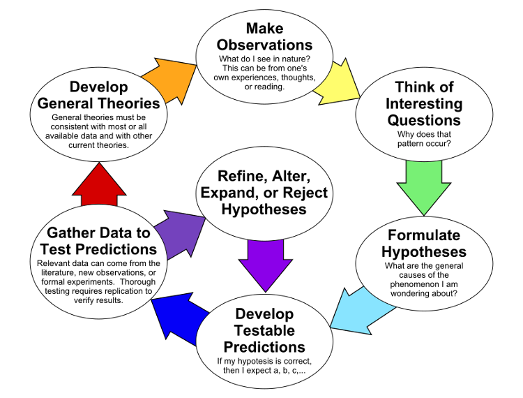
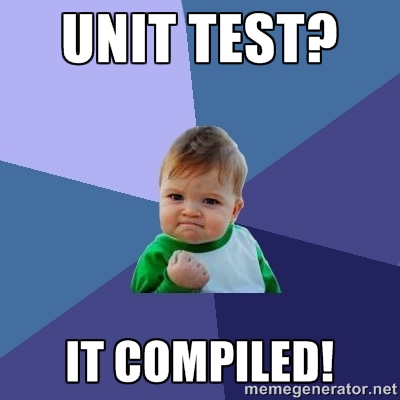
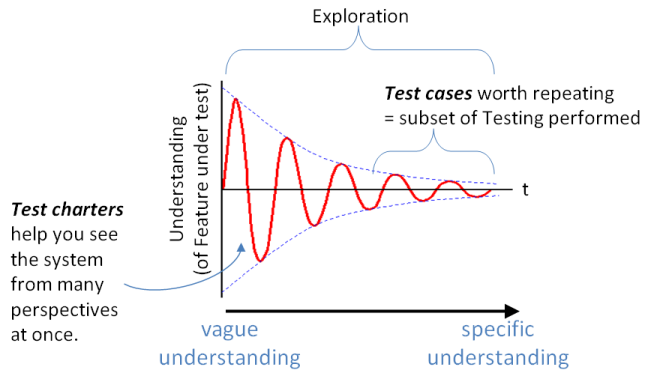
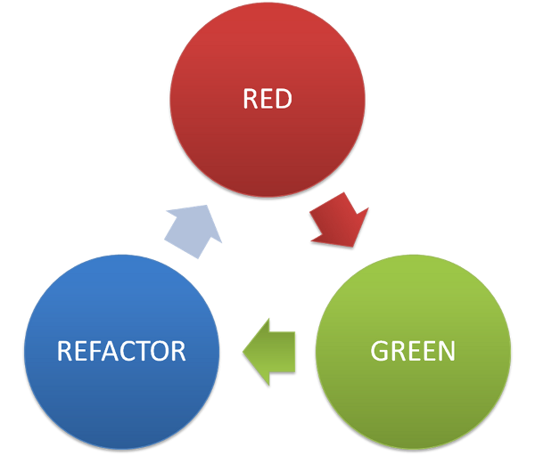

class: center, middle, inverse
# Testing as a medium

---
# Who am I?

- .big[CESAR SAEZ]
- Character TD @ Animal Logic.
- Free and open source software enthusiast.
- All things Python.
- Music lover.
- Developer wannabe.
- http://cesarsaez.me
- [@csaezmargotta](https://twitter.com/csaezmargotta) (twitter)

---
# Agenda

1. Introduction
2. Testing as Technical Artists
3. Automated testing
4. Beyond the quality gate
5. Test-driven development
6. Testing legacy projects (coverage)
7. It's not only about us!

---
class: center, middle, inverse

# What is this talk about?

---
# This is *not* about:

- *Agile* dogmas/methodologies.

--

- A tutorial on procedures.

--

- Language/framework specific.

--

- Me lecturing you.

---
# This is an *open discussion* on:

- What do we understand by testing.

--

- What are the benefits.

--

- What are the costs.

--

- Where are we in terms of testing.

--

- What can we do to improve the current situation.

---
class: center, middle, inverse

# What is testing?

(unit testing, integration testing, exploratory testing, usability testing,
performance/load testing, anything!)

---

# Testing

According to Wikipedia:

> Software testing is an investigation conducted to *provide stakeholders with
> information about the quality* of the product or service under test.

--

mmm.... what about tests:

> A test is an *experiment* designed to *reveal information* or answer a
> specific question about the software or system.

--

### tl;dr: make sure the system works as expected.

---
class: center, middle, clear



---
class: center, middle, clear

# Do we test?

---
class: center, middle, clear

## Of course we do!.red[*]

_ .footnote[.red[*] "It works in my computer".]_
---
class: center, middle, inverse

# Automated testing

---

# Automated testing

.big[What are the benefits *from a developer POV*?]

--

- Enable refactoring

--

- Avoid regressions bugs .red[*]

.footnote[ .red[*] Or at least reduce the likelihood of a regression.]

--

> ... althought it seems to add some overhead to the development proccess
> by adding an extra "phase" after the problem has been solved (similar to
> documentation).

---
class: center, middle, clear



---
class: center, middle, inverse

# Beyond the quality gate

---
# Testing as a medium

--

> Exploratory testing is simultaneously *learning about the system* while
> designing and executing tests, *using feedback from the last test to inform
> the next*.
> .right[Elisabeth Hendrickson]

--

What about this one?

> Testing is the *medium in which solutions are developed*. The value of our
> delivered solutions depend upon how well we understand and utilize that medium.
> .right[Paul Carvalho]

---
class: center, middle, clear



---
class: center, middle, inverse

# Test-driven development

---
class: center, middle, clear



---

# Test-driven development

Benefits *from a developer point of view*:

- All the previous benefits plus...

--

- Leads to better design.

--

- Inform us where to go next.

--

- Up to date sample code (in form of tests).

--

- Demostrate concrete progress.

--

- It's fun! .red[*]

---

# Study Case: *AL's website*

.big[Greeting onLoad (javascript):]

```javascript
function displayTimeofDayGreeting() {
    var e = new Date,
        t = e.getHours(),
        n = e.getMinutes(),
        r = "";
    (t > 5 || t == 5 && n >= 30) && t < 12 ? r = "morning" : t < 17 ? r = "afternoon" : t < 22 ? r = "evening" : r = "night";
    this.$el.find(".doodle").each(function() {
      var e = $(this);
      e.attr("data-timeofday") != r && e.remove();
    })
}
```

.footnote[.red[*] Production code (likely untested)]

---

# Study Case: *AL's website*

.big[Greeting onLoad (javascript):]

```javascript
function displayTimeofDayGreeting(date) {
    var t = date.getHours(),
        n = date.getMinutes(),
        r = "";

    (t > 5 || t == 5 && n >= 30) && t < 12 ? r = "morning" : t < 17 ? r = "afternoon" : t < 22 ? r = "evening" : r = "night";

    return r;
}
```

.footnote[.red[*] Testable code (decoupled, a.k.a. _"pure"_ function)]

---

class: center, middle, inverse

# Testing legacy projects

---
class: center, middle, inverse

# Ultimately, it's not about us!
